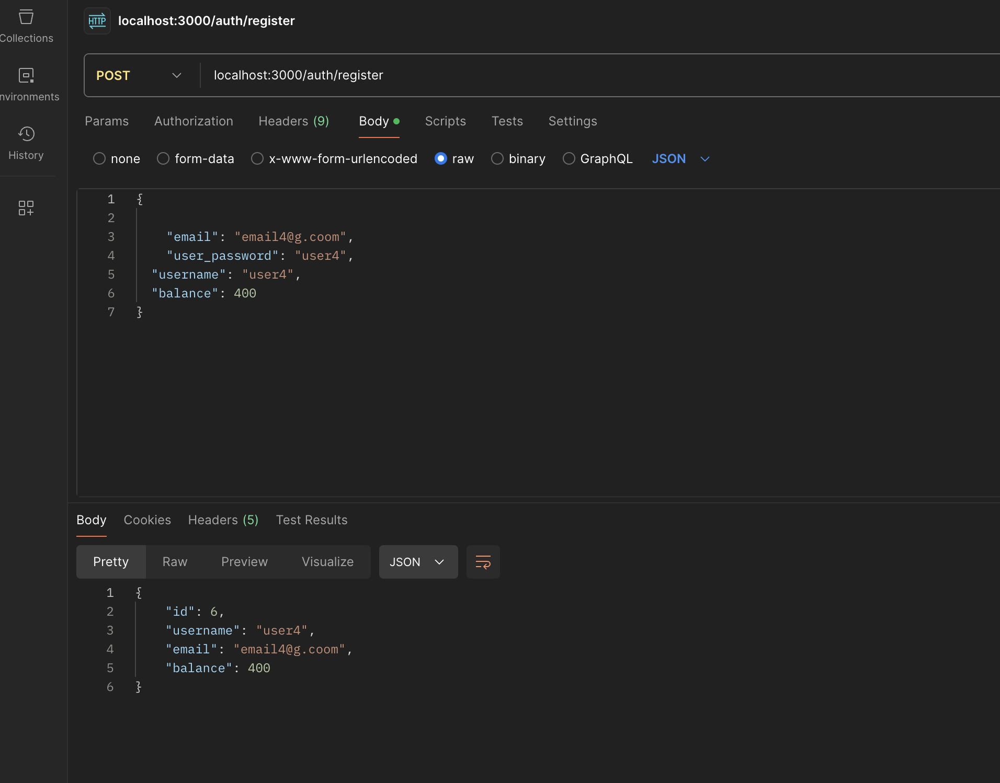
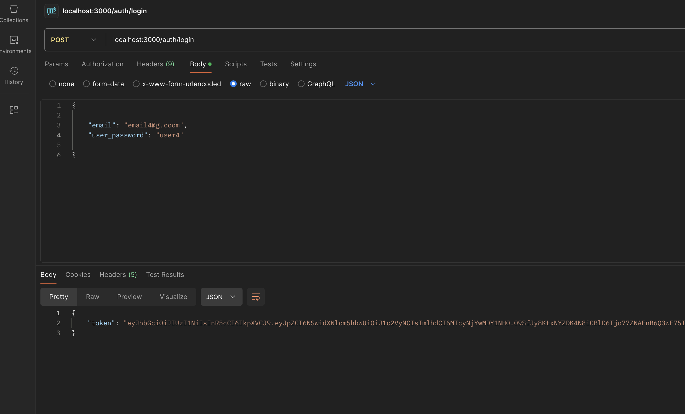
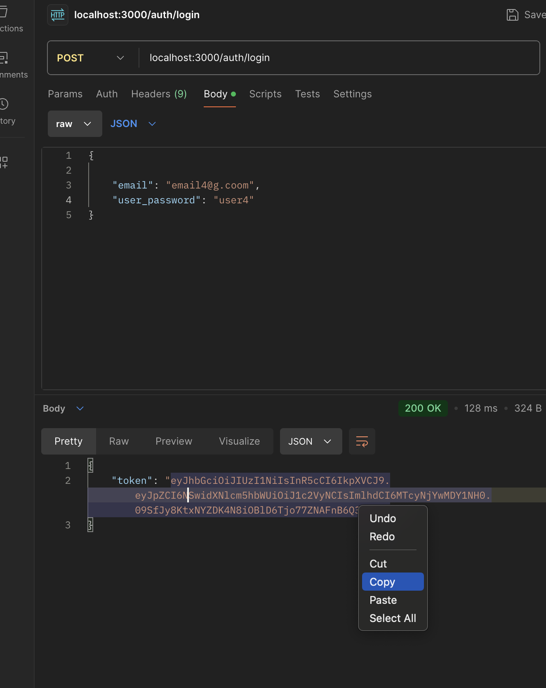
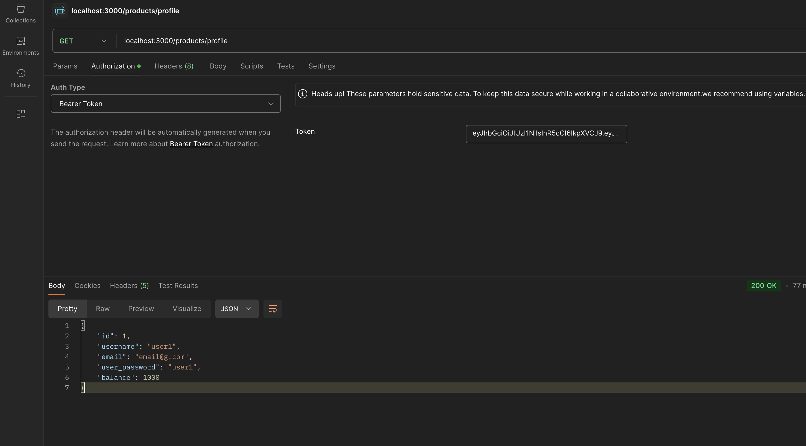
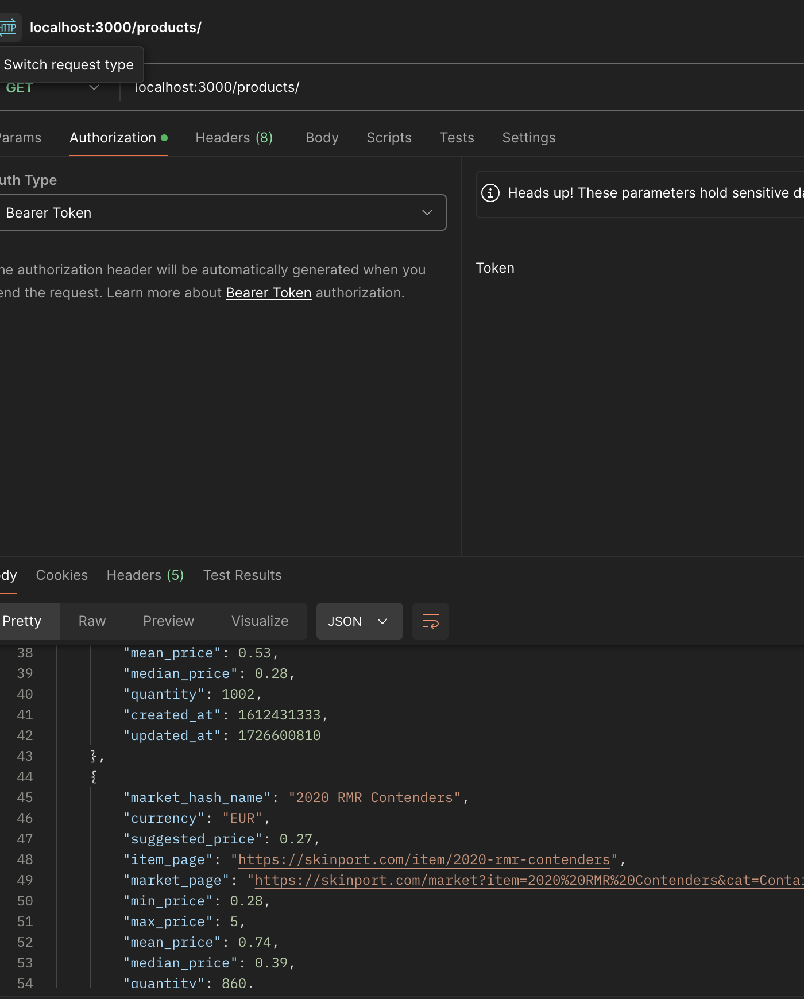
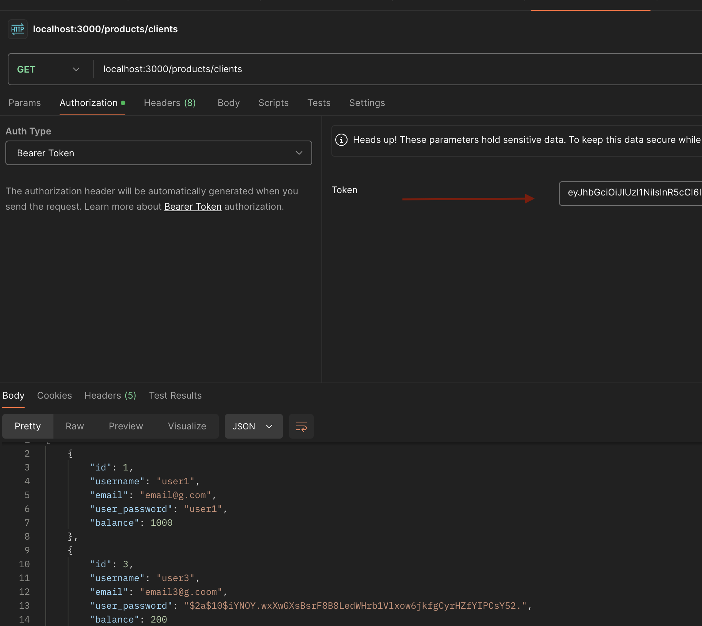
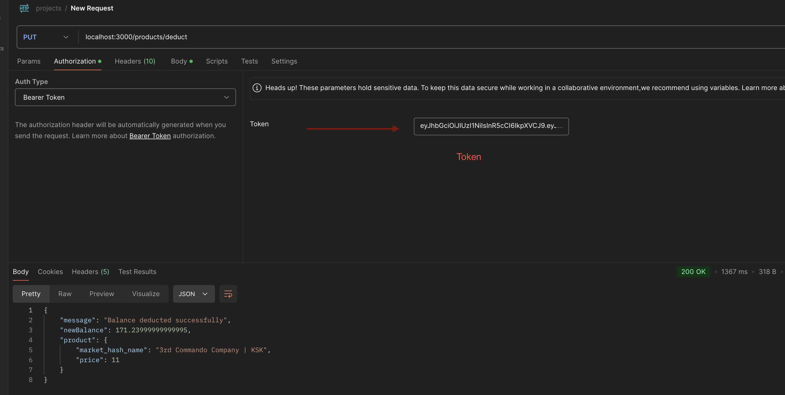
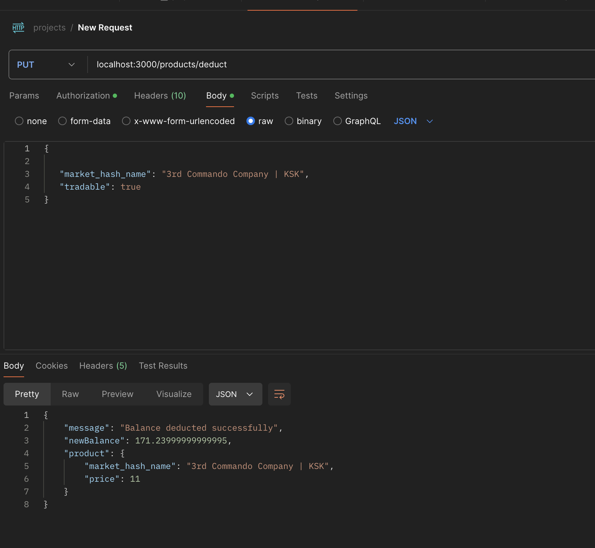

# Fastify-project

Приложение для покупок c использованием технологий fastify, PostgreeSQL,  JWT, Postman


## Установка зависимостей 
Для данного приложения обязательнно предварительнно установить глобально Node.js, npm, nodemon 

## Установка локальных зависимостей 

```bash
  cd .
  npm i
```

### ENV переменные
USERNAME=db_user
PASSWORD=password
HOST=localhost
PORT=5432
DB=fastify
SECRET=somesecret
   
## Запуск проекта
```bash
 $ npm run dev
```

## Регистрация клиента

```http
  POST /auth/register
```



| Parameter | Type     | Description                |
| :-------- | :------- | :------------------------- |
| `email` | `string` | **Required**. g@gmail.com |
| `user_password` | `string` | **Required**. password |
| `username` | `string` | **Required**. username1 |
| `balance` | `number` | **Required**. 200 |

## Логин клиента -  Возвращается токен его надо будет скопировать

```http
  POST /auth/login
```



| Parameter | Type     | Description                |
| :-------- | :------- | :------------------------- |
| `email` | `string` | **Required**. g@gmail.com |
| `user_password` | `string` | **Required**. password |


#### Нам возвращается токен, который нам нужно будет скопировать

## Личный кабинет

```http
  GET /products/profile
  Authorization: Bearer <your-token>
```



#### !Обязательно внести токен


## Доступные продукты

```http
  GET /products/
```



## Клиенты

```http
  GET /products/clients
  Authorization: Bearer <your-token>
```


Для отпраки данного запроса нам потребуется внести bearer token, его надо скопировать по запрос /auth/login



## Покупка продукта

```http
  PUT /products/deduct
  Authorization: Bearer <your-token>
```




| Parameter | Type     | Description                       |
| :-------- | :------- | :-------------------------------- |
| `market_hash_name`      | `string` | **Required**. name of the product |
`tradable`      | `boolean` | **Required**. true |


